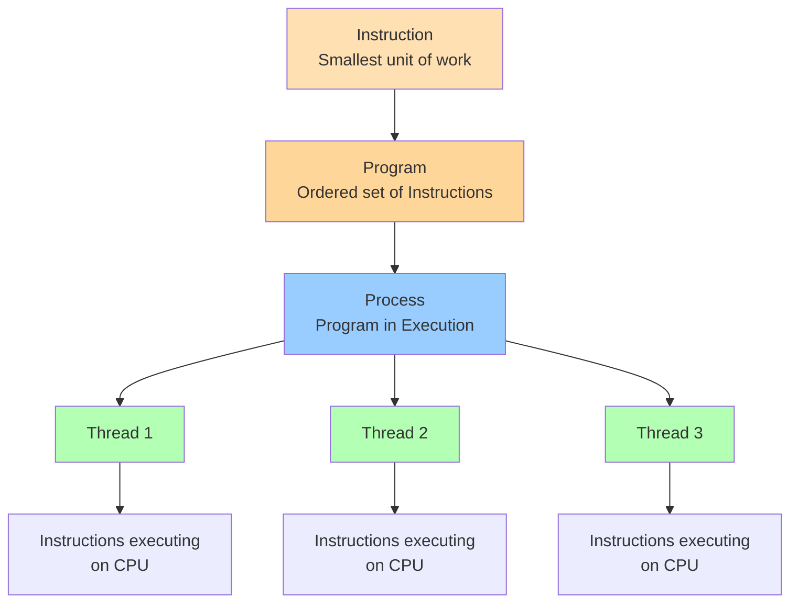
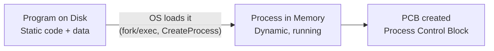
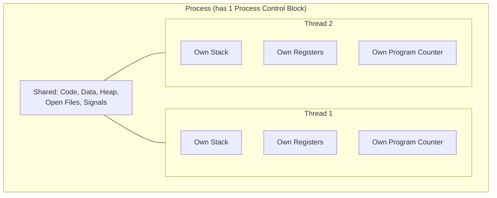
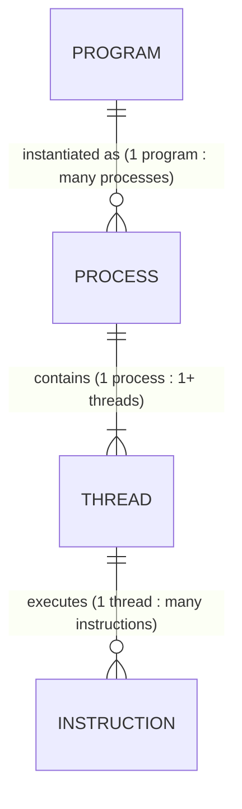
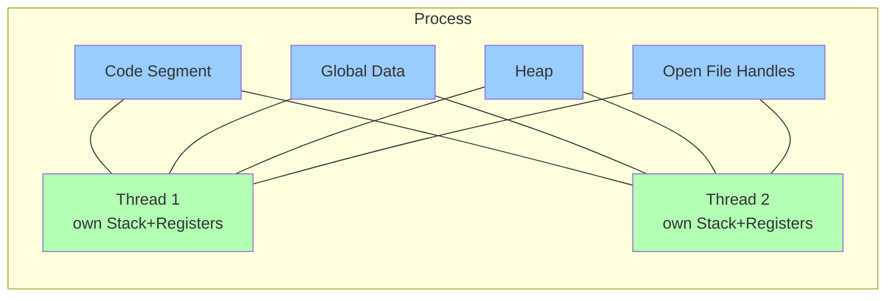
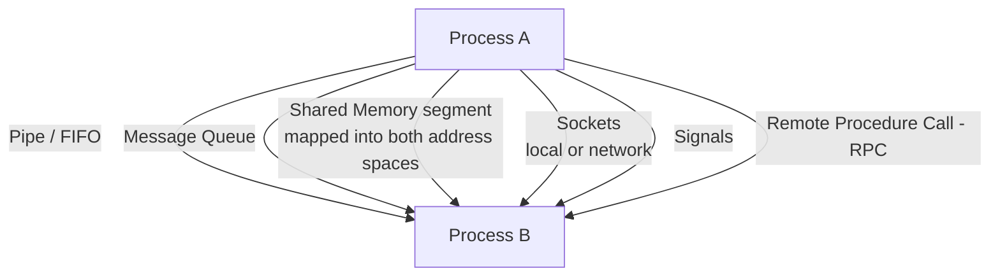
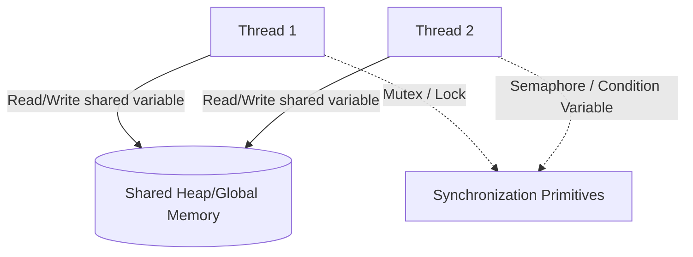
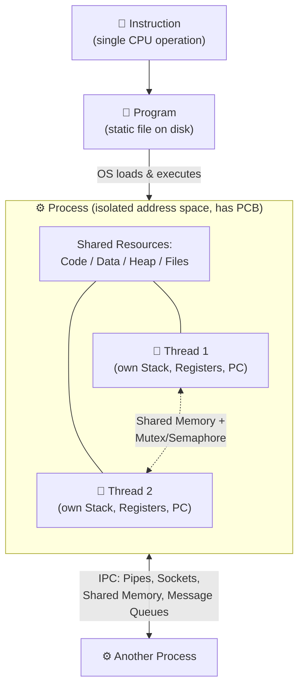

# Instruction, Program, Process & Thread — Complete Guide

## 1. The Big Picture (Hierarchy Diagram)



**One-line definitions:**

| Term | Definition |
|---|---|
| **Instruction** | A single low-level operation the CPU can execute (e.g. `ADD`, `MOV`, `LOAD`). |
| **Program** | A passive, static set of instructions stored on disk (e.g. an `.exe` file). It does nothing by itself. |
| **Process** | An **active instance** of a program that is loaded into memory and being executed by the OS. Has its own memory space. |
| **Thread** | The smallest unit of **CPU execution** inside a process. A process has ≥1 threads that share the process's resources. |

---

## 2. Structural Diagrams

### 2.1 Instruction → Program

```
PROGRAM (on disk, e.g. app.exe)
┌─────────────────────────────┐
│ Instruction 1: LOAD  R1, A  │
│ Instruction 2: LOAD  R2, B  │
│ Instruction 3: ADD   R1, R2 │
│ Instruction 4: STORE R1, C  │
│ Instruction 5: JMP   Loop   │
└─────────────────────────────┘
     A program is just an ordered,
     static sequence of instructions.
```

### 2.2 Program → Process (What happens at launch)



### 2.3 Internal Structure of a Process (Memory Layout)

```
        HIGH ADDRESS
┌─────────────────────────┐
│   Stack (per-thread)    │  ← function calls, local vars,
│           ↓             │    grows downward
│                         │
│                         │
│           ↑             │
│   Heap                  │  ← dynamic memory (malloc/new),
│                         │    grows upward, SHARED by threads
├─────────────────────────┤
│   BSS (uninit. data)    │
├─────────────────────────┤
│   Data (global/static)  │  ← SHARED by all threads
├─────────────────────────┤
│   Text/Code segment     │  ← the actual instructions, SHARED
└─────────────────────────┘
        LOW ADDRESS
```

### 2.4 Process Control Block (PCB) — the OS's "ID card" for a process

```
┌────────────────────────────┐
│        PCB                 │
├────────────────────────────┤
│ Process ID (PID)           │
│ Process State (Ready/Run..)│
│ Program Counter            │
│ CPU Registers               │
│ Memory Management Info     │
│ Open File List              │
│ Scheduling Info             │
│ Pointer to Thread(s)/TCBs   │
└────────────────────────────┘
```

### 2.5 Process → Thread(s) Structure



**Thread Control Block (TCB)** — lighter than a PCB:
```
┌───────────────────────┐
│        TCB             │
├───────────────────────┤
│ Thread ID               │
│ Thread State             │
│ Program Counter          │
│ Registers                │
│ Stack Pointer             │
│ Pointer back to Parent PCB│
└───────────────────────┘
```

---

## 3. How They Relate (Cardinality)

```
1 Program        can produce      Many Processes   (run the same app twice → 2 processes)
1 Process         contains         1..N Threads     (at least 1 "main" thread always exists)
1 Thread           executes        Many Instructions (sequentially, one at a time per core)
```



---

## 4. Resource Sharing

### 4.1 Between Processes → mostly **isolated**
Each process gets its own virtual address space. The OS enforces isolation so one process can't directly touch another's memory (protects stability/security).

| Resource | Shared across processes? |
|---|---|
| Memory (code/data/heap/stack) | ❌ No — separate address spaces |
| File descriptors | ❌ No (unless explicitly passed) |
| CPU registers | ❌ No |
| PID / Process metadata | ❌ No (unique per process) |

### 4.2 Between Threads (within the same process) → mostly **shared**



| Resource | Shared across threads (same process)? |
|---|---|
| Code segment | ✅ Yes |
| Global/static data | ✅ Yes |
| Heap memory | ✅ Yes |
| Open files/sockets | ✅ Yes |
| **Stack** | ❌ No — each thread has its own |
| **Registers / PC** | ❌ No — each thread has its own |

> This is *why* threads are called "lightweight": creating a thread only needs a new stack + TCB, not a whole new address space — much cheaper than creating a process.

---

## 5. Communication Systems

### 5.1 Inter-Process Communication (IPC) — since memory is isolated, processes need OS-provided channels



| IPC Mechanism | How it works | Typical use |
|---|---|---|
| **Pipes / FIFOs** | Unidirectional byte stream via kernel buffer | `ls \| grep`, parent-child |
| **Message Queues** | OS-managed queue of discrete messages | Producer-consumer across processes |
| **Shared Memory** | A memory segment mapped into >1 process's address space (fastest, but needs manual sync) | High-performance data sharing |
| **Sockets** | Endpoint-based communication (works locally or over network) | Client-server, microservices |
| **Signals** | Async notification (e.g. `SIGKILL`, `SIGTERM`) | Interrupting/controlling a process |
| **RPC** | Call a function that runs in another process/machine | Distributed systems |

### 5.2 Inter-Thread Communication — much simpler, since memory is already shared



| Mechanism | Purpose |
|---|---|
| **Shared variables** | Threads just read/write the same memory directly — no OS call needed |
| **Mutex / Lock** | Ensures only one thread touches a critical section at a time |
| **Semaphore** | Controls access to a limited number of resource instances |
| **Condition Variable** | Lets a thread wait until a condition becomes true |
| **Monitor** | High-level construct bundling lock + condition variable |

> **Key contrast:** Processes talk *through the OS* (because they can't see each other's memory). Threads talk *through shared memory directly*, but must use synchronization primitives to avoid race conditions.

---

## 6. Full Combined Diagram



---

## 7. Summary Table

| Aspect | Instruction | Program | Process | Thread |
|---|---|---|---|---|
| **Nature** | Static, atomic | Static, passive | Dynamic, active | Dynamic, active |
| **Location** | Part of code | Disk | Memory | Inside a process (memory) |
| **Has own memory?** | N/A | N/A | ✅ Yes (isolated) | ❌ No (shares process memory), only own stack |
| **OS control block** | — | — | PCB | TCB |
| **Creation cost** | — | — | Heavy (new address space) | Light (new stack only) |
| **Communication** | — | — | IPC (pipes, sockets, shared memory) | Shared memory + locks |
| **Isolation** | — | — | Strong (protected by OS) | Weak (shares everything but stack) |

---

*Tip: If you paste this `.md` file into a Markdown viewer that supports **Mermaid** (GitHub, Obsidian, Typora, VS Code with the Markdown Preview Mermaid extension), all diagrams above will render visually instead of as code blocks.*
